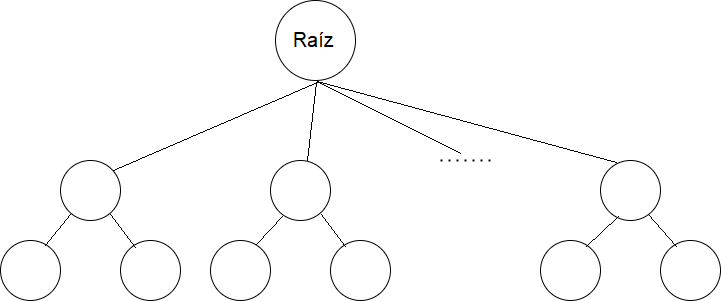

# TDA ABB

## Repositorio de Maximiliano Muruchi - 105702 - maxmuruchi@gmail.com

- Para compilar:

```bash
línea de compilación
```

- Para ejecutar:

```bash
línea de ejecución
```

- Para ejecutar con valgrind:
```bash
línea con valgrind
```
---
##  Funcionamiento

Explicación de cómo funcionan las estructuras desarrolladas en el TP y el funcionamiento general del mismo.

Aclarar en esta parte todas las decisiones que se tomaron al realizar el TP, cosas que no se aclaren en el enunciado, fragmentos de código que necesiten explicación extra, etc.

Incluír **EN TODOS LOS TPS** los diagramas relevantes al problema (mayormente diagramas de memoria para explicar las estructuras, pero se pueden utilizar otros diagramas si es necesario).

### Por ejemplo:

El programa funciona abriendo el archivo pasado como parámetro y leyendolo línea por línea. Por cada línea crea un registro e intenta agregarlo al vector. La función de lectura intenta leer todo el archivo o hasta encontrar el primer error. Devuelve un vector con todos los registros creados.

<div align="center">

</div>

En el archivo `sarasa.c` la función `funcion1` utiliza `realloc` para agrandar la zona de memoria utilizada para conquistar el mundo. El resultado de `realloc` lo guardo en una variable auxiliar para no perder el puntero original en caso de error:

```c
int *vector = realloc(vector_original, (n+1)*sizeof(int));

if(vector == NULL)
    return -1;
vector_original = vector;
```


<div align="center">

</div>

---

## Respuestas a las preguntas teóricas


# Árbol

El **Árbol** es una colección de nodos que pueden estar conectados a otros multiples nodos.
El Árbol contiene un nodo principal llamado **Raíz** y este puede tener cero o multiples subarboles no vacios conectados.

<div align="center">

</div>

# Árbol Binario

El **Árbol Binario** está relacionado con la operación de búsqueda.
El **Árbol contiene** el nodo principal raíz y este puede tener hasta 2 nodos conectados.
Al realizarse la búsqueda se puede saber por donde buscar, puede ir por izquierda o por derecha de un valor determinado.

<div align="center">

</div>


# Árbol Binario de Búsqueda (ABB)

El **Árbol Binario de Búsqueda** está relacionado con el Árbol Binario con el tema de sus estructuras.
Para este árbol hay un criterio de orden para realizar la búsqueda de un elemento con el uso de un comparador.

# Operaciones del Árbol

El árbol contiene estás operaciones:
	- Crear
	- Destruir
	- Vacío
	- Insertar
	- Quitar
	- Buscar
	- Recorrer
	
### Crear
Crea la estructura del árbol. **Complejidad O(1)**.

### Destruir
Destruye la estructura del árbol. Primero destruye sus nodos de abajo hacia arriba, y por último destruye a la raíz. **Complejidad O(n)**.

### Vacío
Devuelve un booleano si el árbol está vacío o no. **Complejidad O(1)**.

### Insertar
Para insertar, es necesario que se comparen los elementos que tienen los nodos con el que voy a insertar.
Primero comparo el elemento con la raíz, si es mayor avanzo a la derecha y si es menor a la izquierda.
Si ambos elementos son iguales eso dependerá de como se implemente, puede ir a la izquierda o a la derecha.
Este elemento se insertará cuando este llegue al final cuando no haya más por donde recorrer, este pedirá memoria y se insertará a la izquierda o la derecha dependiendo de su valor.

**Complejidad O(log n)** Esta complejidad se debe porque no recorre todos los nodos para ir a insertarlo.

**Complejidad O(n)** Este es el peor caso de un árbol. Esto ocurre cuando el árbol ya no tiene forma de árbol sino de una **Lista**.

### Quitar
Para quitar, es necesario que se comparen los elementos que tienen los nodos con el que voy a quitar.
Voy comparando los elementos de los nodos para buscar el elemento que voy a borrar.
Si lo encuentro borro el nodo con algunas condiciones.
```
	- El nodo que no tiene hijos también llamado **Nodo Hoja**, lo puedo borrar sin problemas.
	- El nodo que tiene al menos un hijo también llamado **Nodo Padre**, para borrarlo tengo que sustituirlo por alguno de sus hijos puede ser izquierdo o derecho.
	- El **Nodo Padre** que tiene dos hijos, para borrarlo tengo que elegir al predecesor o sucesor más cercano a este Nodo Padre, luego lo sustituyo y borro al Nodo Padre.
```	
**Complejidad O(log n)** Esta complejidad se debe porque no recorre todos los nodos para buscar al elemento y quitarlo.

**Complejidad O(n)** Este caso solo ocurre cuando el árbol tiene forma de Lista. Recorre todos los elementos hasta el elemento que encontre y lo borre.

### Buscar
Para buscar empiezo por la raíz y voy comparando, si mi elemento es menor al elemento del nodo que estoy comparando, voy por izquierda en caso contrario voy por la derecha. 
Repito esto recursivamente hasta encontrar el elemento que estoy buscando.

**Complejidad O(log n)** Comparo con el nodo y dependiendo del resultado voy para la izquierda o para la derecha, no recorre todos los elementos.

**Complejidad O(n)** Este caso solo ocurre cuando el árbol tiene forma de Lista. Recorre todos los elementos hasta el que busco.

### Recorrer
Está operación tiene 6 formas de recorrer el árbol, pero hay 3 formas que son importantes:
	- Inorden
	- Preorden
	- Postorden
	
	- Inorden
	Recorro el árbol visitando primero al nodo izquierda, luego al nodo actual y el nodo derecho.
	
	- Preorden
	Recorro el árbol visitando primero al nodo actual, luego al nodo izquierdo y el nodo derecho.
	
	- Postorden
	Recorro el árbol visitando primero al nodo izquierdo, luego al nodo derecho y al nodo actual.
	
**Complejidad O(n)** Recorro todos los nodos.


## TP de ABB

La implementación de mi trabajo de ABB se realizó con funciones recursivas porque ver estos casos son más sencillos de resolver que de forma iterativa por tener más pedidos de for/while para cada caso de recorrido.

<div align="center">

</div>


### Crear
Crea la estructura del árbol. **Complejidad O(1)**.

### Destruir
Destruye la estructura del árbol. Primero destruye sus nodos de abajo hacia arriba, y por último destruye a la raíz.
**Complejidad O(n)**.

### Destruir todo
Destruye la estructura del árbol. Primero destruye los elementos de sus nodos si el usuario guardo un elemento que haya pedido memoria y luego a los nodos de abajo hacia arriba, y por último destruye a la raíz.
**Complejidad O(n)**.

### Vacío
Devuelve un booleano si el árbol está vacío o no.
**Complejidad O(1)**.

### Tamaño
Devuelve la cantidad de elementos que se almacenaron en el árbol.
**Complejidad O(1)**.

### Insertar
Insertar llama a una función recursiva que hará el trabajo de insertar el nodo.
Al entrar a la función primero verificará si el nodo en donde estoy parado es NULL en ese caso se inserta el nodo. 
El primer caso sería si el árbol está vacío, lo insertaría y sería la raíz del árbol.
En caso de que no sea la raíz y quiera insertar otro elemento, voy a tener ir comparando el elemento que voy a insertar con el elemento que está en el nodo,
si el elemento es menor o igual al elemento del nodo, voy a tener que ir hacia la izquierda en caso contrario voy para la derecha, y así recursivamente hasta que llegar a una parte NULL para insertar mi elemento.

**Complejidad O(log n)** Comparo con el nodo y dependiendo del resultado voy para la izquierda o para la derecha, no recorre todos los elementos para insertar al final.

**Complejidad O(n)** Este caso solo ocurre cuando el árbol tiene forma de Lista. Recorre todos los elementos hasta llegar al final e insertarlo.

<div align="center">

</div>

### Quitar
En la función de quitar un elemento cree un booleano para ver si borro el elemento y un puntero que guardará el elemento para después devolverlo si el booleano dió true en caso contrario devuelve NULL.
También tengo una función recursiva que va borrar al nodo con el elemento, en caso de no encontrarlo devuelve NULL.
Para buscar al elemento va a ir a buscarlo comparando con otros elementos dependiendo del resultado este va a ir por izquierda o por derecha.
Cuando se encontro al elemento, el borrado pasa a ser True y además guardo el elemento del nodo para devolverlo.
Ahora para quitar al elemento, me tenía que fijar si el nodo del elemento era un nodo hoja o si tenía algún hijo o si tenía ambos.
```	- Si era un nodo hoja solo lo liberaba.
	- Si mi nodo tenía un hijo sea en izquierda o en derecha, guardo a su hijo, libero a mi nodo y devuelvo a su hijo, este pasará a ser el nuevo nodo que conecte con el nodo anterior.
	- Si mi nodo tenía ambos hijos:
		1 - Primero busco al nodo que lo reemplace yendo por la izquierda, y buscar al que lo precede yendo por la derecha y una vez que lo encuentro me lo guardo.
		2 - Luego cambio el elemento de mi nodo por el que encontre de reemplazo.
		3 - Por último, voy a buscar al nodo que use de reemplazo para borrarlo y si tenía un hijo por izquierda este pasaría a ser el nodo que conecte con el anterior y si no lo tiene sería NULL.
```	
**Complejidad O(log n)** Comparo con el nodo y dependiendo del resultado voy para la izquierda o para la derecha, no recorre todos los elementos.

**Complejidad O(n)** Este caso solo ocurre cuando el árbol tiene forma de Lista. Recorre todos los elementos hasta el que busco.

<div align="center">

</div>

<div align="center">

</div>

### Buscar
Buscar llama a una función recursiva que buscará al elemento que se pidió.
Al entrar a la función primero verificará si el nodo en donde estoy parado es NULL o al compararlo con el nodo en donde estoy parado es igual, esto devolverá al nodo si es NULL o al nodo con el elemento.
Si el resultador al comparar ambos elementos es menor voy a buscar por la izquierda sino busco por la derecha.

**Complejidad O(log n)** Comparo con el nodo y dependiendo del resultado voy para la izquierda o para la derecha, no recorre todos los elementos.

**Complejidad O(n)** Este caso solo ocurre cuando el árbol tiene forma de Lista. Recorre todos los elementos hasta el que busco.

<div align="center">

</div>

### Iteradores
Para los iteradores externos e internos les cree sus 3 formas de recorrido para cada uno.
	- Inorden
	- Preorden
	- Postorden

### ABB con cada elemento
El recorrido interno del árbol, usa los 3 recorridos ya mencionados, también tiene un boleano para saber cuando cortará la iteración cuando se lo pida, también tiene un variable cantidad para contar las veces que se llamó a la función auxiliar.
Al entrar a una de los recorridos pedidos, se preguntará si se seguirá la iteración en base a la variable del booleano, si todavía no se corto la iteración se sumará en 1 la cantidad de veces que se uso la función y también actualizará la variable booleana dependiendo del resultado de la función.
**Complejidad O(n)** Recorro todos los nodos si la función auxiliar dada por el usuario no corta la iteración.

### Recorrer
El recorrido externo del árbol, usa los 3 recorridos ya mencionados, tiene un variable cantidad para contar las veces que se llamó a la función auxiliar, este iterador recibe como parametro un array y su tamaño para insertar los elementos.
Al entrar a una de los recorridos pedidos, se preguntará si se seguirá la iteración si la cantidad es menor al tamaño del array, si todavía no se corto la iteración se sumará en 1 la cantidad de veces que se uso la función y se añadira ese elemento al vector.
**Complejidad O(n)** Recorro todos los nodos si la función auxiliar dada por el usuario no corta la iteración.


