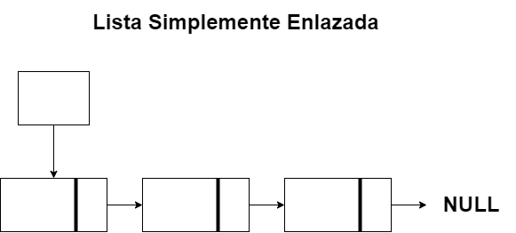
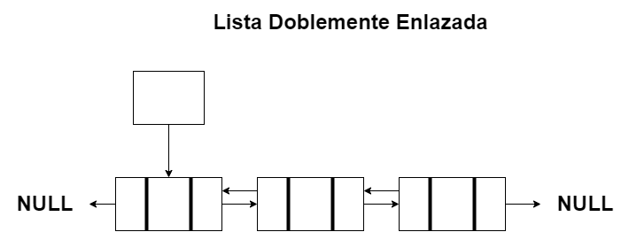
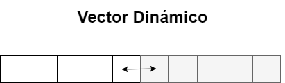
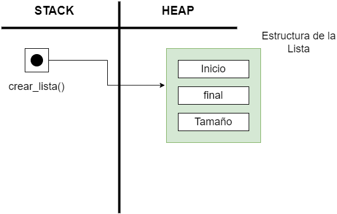
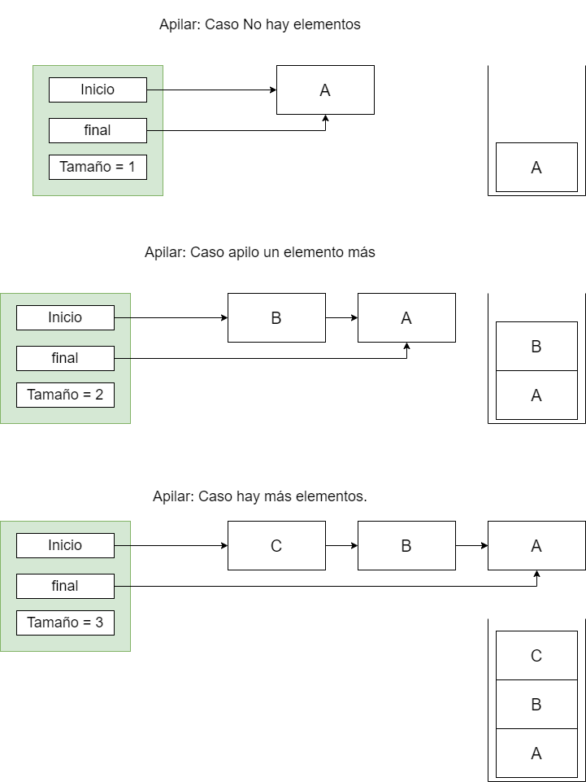
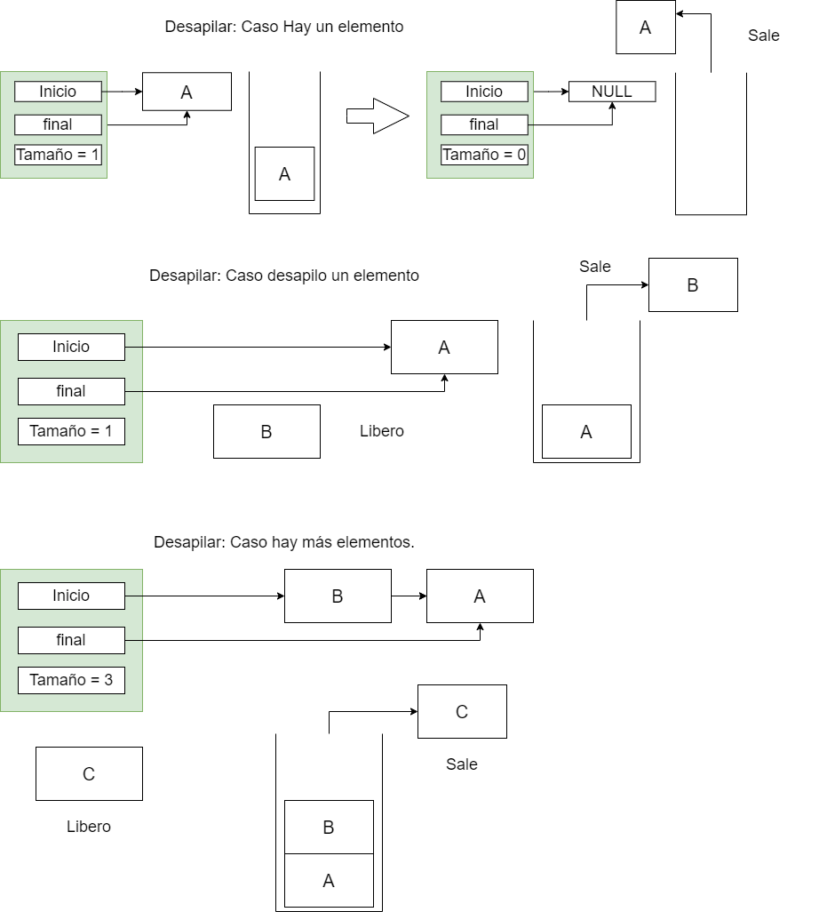
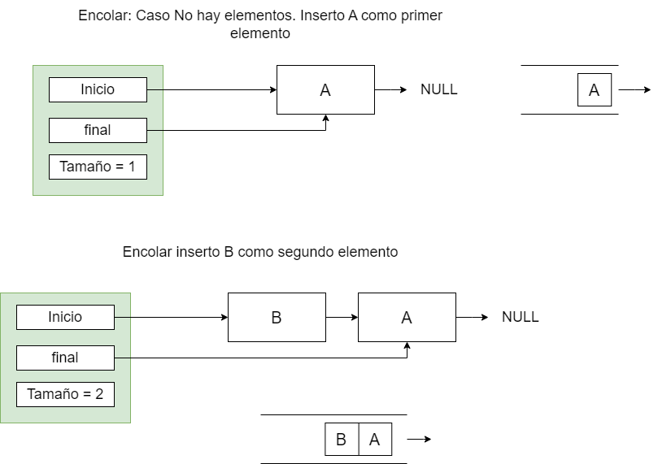
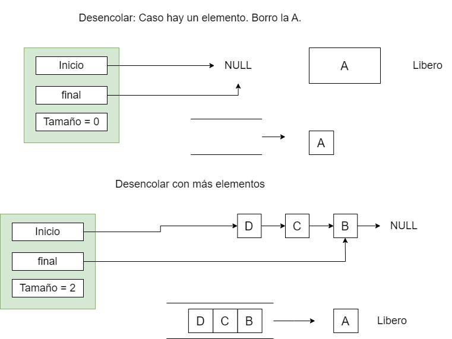

<div align="right">

</div>

# TDA LISTA

## Alumno: Maximiliano Muruchi - 105702 - maxmuruchi@gmail.com 

- Para compilar:

```bash
línea de compilación
```

- Para ejecutar:

```bash
línea de ejecución
```

- Para ejecutar con valgrind:
```bash
línea con valgrind
```

---

##  Funcionamiento

Explicación de cómo funcionan las estructuras desarrolladas en el TP y el funcionamiento general del mismo.

Aclarar en esta parte todas las decisiones que se tomaron al realizar el TP, cosas que no se aclaren en el enunciado, fragmentos de código que necesiten explicación extra, etc.

Incluír **EN TODOS LOS TPS** los diagramas relevantes al problema (mayormente diagramas de memoria para explicar las estructuras, pero se pueden utilizar otros diagramas si es necesario).

### Por ejemplo:

El programa funciona abriendo el archivo pasado como parámetro y leyendolo línea por línea. Por cada línea crea un registro e intenta agregarlo al vector. La función de lectura intenta leer todo el archivo o hasta encontrar el primer error. Devuelve un vector con todos los registros creados.

<div align="center">

</div>

En el archivo `sarasa.c` la función `funcion1` utiliza `realloc` para agrandar la zona de memoria utilizada para conquistar el mundo. El resultado de `realloc` lo guardo en una variable auxiliar para no perder el puntero original en caso de error:

```c
int *vector = realloc(vector_original, (n+1)*sizeof(int));

if(vector == NULL)
    return -1;
vector_original = vector;
```


<div align="center">

</div>

---

## Respuestas a las preguntas teóricas
Incluír acá las respuestas a las preguntas del enunciado (si aplica).


La **Lista Enlazada** es una estructura de datos que consiste en una serie de nodos conectados por punteros. Estos nodos contienen un **dato** y un **puntero al siguiente nodo** de la lista.
En mi caso, opte por hacer una lista con un puntero que **apunta al primer nodo** de la lista  y otro al **final del nodo** de la lista.

<div align="center">

</div>

La **Pila** es una estructura de datos que contiene una colección ordenada de elementos, de la cual sigue el principio de **LIFO**: Last In First Out (El último que entra es el primero que sale).

<div align="center">

</div>

La **Cola** es una estructura de datos que contiene una colección ordenada de elementos, de la cual sigue el principio de **FIFO**: First In First Out (El primer que entra es el primero que sale).

<div align="center">

</div>

La **Lista Simplemente Enlazada** se caracteriza solo por tener un puntero que apunta al primer nodo, este nodo contiene un dato y un puntero al siguiente.

<div align="center">

</div>

La **Lista Doblemente Enlazada** se caracteriza solo por tener un puntero al primer nodo, este nodo contiene el dato y dos punteros. Estos dos punteros van a estar apuntando a un nodo anterior y a un nodo siguiente, eso sí, esto será para los casos de nodos que están entre el nodo de inicio y el nodo del final.
El nodo de inicio tendrá un dato y un puntero apuntando al siguiente mientras que el puntero al anterio solo apuntura a NULL. En cambio el nodo del final tendrá el dato y un puntero al anterior y un puntero siguiente a NULL.

<div align="center">

</div>

La **Lista con Vector Dinámico** se caracteriza por ser un vector dinámico sin usar los nodos. Al hacerse más grande la lista, se tendrá que pedir memoria para que se pueda almacenar más elementos.

<div align="center">

</div>

## Diferencias entre Lista Simplemente Enlazada, Lista Doblemente Enlazada y Vector Dinámico

# Diferencias al inicio

<div align="center">

</div>

En el caso de LSE y LDE solo basta con ver el inicio de la lista:
Para insertar solo se crea el nodo si la lista está vacía este queda como el inicio y final.
Si hay elementos solo se crea el nuevo nodo y apunto los punteros al siguiente elemento y cambio el puntero de inicio de lista al nuevo nodo.
Para obtener, solo basta con ver el puntero del inicio.
Para borrar solo se libera al nodo si es el único elemento de la lista. En caso de tener más de un elemento, se tiene un nodo auxiliar que guardará este nodo y lo liberará, dejando al siguiente como el nodo inicio de lista.

En el caso de Vector Dinámico:
Insertar al inicio es O(n) ya que para hacerlo tendría que estar moviendo todos los elementos que están adelante del mismo.
Para Obtener solo necesitaria de la posición inicial del elemento.
Para Borrar sería O(n) porque necesitaria mover todos los elementos de adelante hacía la izquierda.

# Diferencias en el medio

<div align="center">

</div>

En el caso de LSE:
Insertar en el medio es un caso que se necesita un nodo que apunte al nodo anterior de la lista y recorrer la lista hasta estar en dicha posicion, para insertarlo mi nuevo nodo debe apuntar al nodo donde estoy parado y mi nodo anterior debe apuntar al nuevo nodo.
Para Obtener recorro la lista hasta llegar al medio y devolver dicho elemento.
Para Borrar necesito de un nodo actual y anterior. Cuando llego al nodo, mi actual va a estar apuntando al mismo y mi anterior al nodo anterior del actual. Mi nodo anterior tiene un puntero al actual pero se lo va a cambiar al actual-siguiente osea al nodo que le sigue mientras que mi actual lo voy a borrar.

En el caso de LDE:
Insertar en el medio es un caso que se necesita un nodo que apunte al nodo anterior de la lista y recorrer la lista hasta estar en dicha posicion, para insertarlo mi nuevo nodo debe apuntar al nodo donde estoy parado y mi nodo anterior debe apuntar al nuevo nodo.
Para Obtener recorro la lista hasta llegar al medio y devolver dicho elemento.
Para Borrar necesito de un nodo actual y anterior. Cuando llego al nodo, mi actual va a estar apuntando al mismo y mi anterior al nodo anterior del actual. Mi nodo anterior tiene un puntero al actual pero se lo va a cambiar al actual-siguiente osea al nodo que le sigue mientras que mi actual lo voy a borrar.

En el caso del Vector Dinámico:
Insertar en el medio consistiría en mover todos los elementos desde donde está mi medio hacia la derecha y luego insertar en la posición dada.
Ejemplo 1|2|3|4|5|6|7 y quiero insertar 10 en el medio, entonces, como el medio está en el 4 tengo que mover todo a la derecha. 1|2|3| |4|5|6|7 y luego insertar el 10. 1|2|3|10|4|5|6|7|.

Para Obtener solo es necesario la posición y luego devolverá el elemento sin haber recorrido el vector.
Para Borrar sería O(n) ya que tendría que mover todos elementos desde mi posición hacia la izquierda.
Ejemplo 1|2|3|4|5|6|7 y quiero eliminar el 4 en el medio, entonces. 1|2|3| |5|6|7 y luego muevo los elementos hacia la izquierda 1|2|3||5|6|7| |.


# Diferencias en el final

<div align="center">

</div>

En el caso de LSE:
Insertar es O(n) u O(1). O(n) si no tengo un nodo que apunte al final, es necesario recorrer la lista hasta llegar al final y luego agregar el nuevo nodo. 
O(1) si tengo un puntero que apunta al final. O sea mi nodo final siguiente va a apuntar al nuevo nodo y luego este pasará a ser el nuevo final.
Para Obtener puede ser O(n) u O(1). O(n) si solo tenemos una lista que apunta al inicio y tenga que recorrer todos los nodos hasta el final.
U O(1) si mi lista tiene un nodo que apunte al nodo final.
Para Borrar necesito de un nodo actual y anterior. Debo recorrer todos los nodos hasta el final y luego liberar el actual mientras que mi nodo anterior va a apuntar a NULL.


En el caso de LDE:
Insertar es O(n) u O(1). O(n) si no tengo un nodo que apunte al final es necesario recorrer la lista y agregar al final uniendo ambos punteros de anterior del nuevo nodo y siguiente del nodo anterior.
O(1) si tengo un puntero que apunta al final. O sea mi nodo final siguiente va a apuntar al nuevo nodo y luego este pasará a ser el nuevo final.
Borrar es O(n), necesitaría un nodo al anterior y uno para liberarlo. Recorro la lista y cuando lo encuentre al final, libero mi nodo actual y el queda como el nodo final y su puntero al siguiente será NULL.

En el caso del Vector Dinámico:
Insertar al final es O(1) ya que le doy su posición y lo agregar a lo último.
Obtener es O(1) ya que con su posición me da su elemento.
Borrar el último elemento es O(1) con solo su posición borro el último elemento sin necesidad de mover los demas elementos.

## Mi trabajo para pila y cola

### Pila

Para **crear la pila** llamo a la funcion de creadora de la lista: 
lista_crear(), reserva memoria en el heap con la estructura de la lista iniciados en null. Reservar la memoria en el heap tiene complejidad O(1).

<div align="center">

</div>

Para **apilar** use la `lista_insertar_en_posición(pila, elemento 0)`. Complejidad O(1).
Para que actue como una Pila, necesito poder insertar al inicio, para empezar si inserto una A al inicio este va a ser el inicio y final en la lista.
Ahora si inserto una B, la A pasa a estar al final y la B al inicio. Esto hace que su complejidad sea O(1) ya que no tengo que recorrer la lista o andar moviendo todos los elementos.

<div align="center">

</div>

Para **desapilar** use la `lista_quitar_en_posición(pila, elemento 0)`. Complejidad O(1).
Para desapilar, debo quitar el último elemento que entro en la Pila. Si tengo en la pila " -> C -> B -> A| ", el que saldría es la C.
La complejidad es O(1) debido a que mi implementación solo saca y borra al primer nodo y mi siguiente nodo pasa a ser el primero y en caso de que sea el único solo lo borra.

<div align="center">

</div>

Para **ver el tope** use la `lista_primero(pila)`. Complejidad O(1).
La complejidad es O(1) porque lista_primero() devuelve el elemento nodo del inicio de la lista.

Para el **tamaño** use la `lista_tamanio(pila)`. Complejidad O(1).
La complejidad es O(1) porque revisa el tamaño en la estructura de la lista y lo devuelve.

Para **vacío** use la `lista_tamanio(pila)`. Complejidad O(1).
La complejidad es O(1) porque verifica que el tamaño en la estructura de la lista sea igual a 0, en caso de que coincidan devuelve true en caso contrario false.

Para **destruir la pila** use la `lista_destruir(pila)`. Complejidad O(n).
La complejidad es O(n) porque para destruir la pila debo pasar por todos los nodos y liberarlos.

<div align="center">

</div>

### Cola

Para **crear la Cola** llamo a la funcion de creadora de la lista: 
lista_crear(), reserva memoria en el heap con la estructura de la lista iniciados en null. Reservar la memoria en el heap tiene complejidad O(1).

Para **encolar** use la `lista_insertar(cola, elemento)`. Complejidad O(1).
Para que actue como una Cola, necesito poder insertar al final, para empezar si inserto una A al inicio este va a ser el inicio y final en la lista.
Ahora si inserto una B, la A pasa a estar al inicio y la B al final. Esto hace que su complejidad sea O(1) ya que no tengo que recorrer la lista o andar moviendo todos los elementos.

<div align="center">

</div>

Para **desencolar** use la `lista_quitar_en_posición(cola, elemento 0)`. Complejidad O(1).
Para desencola, debo quitar el primer elemento que entro en la Cola. Si tengo en la cola " <- A <- B <- C ", el que saldría es la A.
La complejidad es O(1) debido a que mi implementación solo saca y borra al primer nodo y mi siguiente nodo pasa a ser el primero y en caso de que sea el único solo lo borra.

<div align="center">

</div>

Para **ver el frente** use la `lista_primero(cola)`. Complejidad O(1).
La complejidad es O(1) porque lista_primero() devuelve el elemento nodo del inicio de la lista.

Para el **tamaño** use la `lista_tamanio(cola)`. Complejidad O(1).
La complejidad es O(1) porque revisa el tamaño en la estructura de la lista y lo devuelve.

Para **vacío** use la `lista_tamanio(cola)`. Complejidad O(1).
La complejidad es O(1) porque verifica que el tamaño en la estructura de la lista sea igual a 0, en caso de que coincidan devuelve true en caso contrario false.

Para **destruir la cola** use la `lista_destruir(cola)`. Complejidad O(n).
La complejidad es O(n) porque para destruir la cola debo pasar por todos los nodos y liberarlos.
